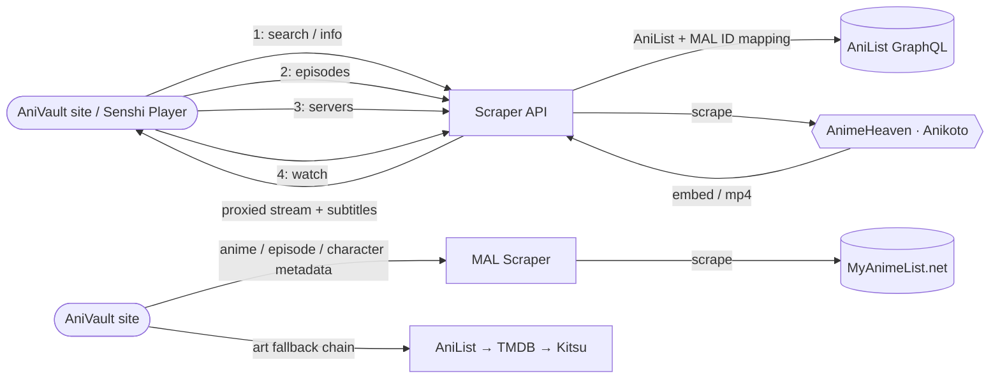

<div align="center">

# AniVault Scraper API

**The video-sourcing and metadata backend for [AniVault](https://www.anivault.co).**

Resolves anime titles → episodes → live, playable streams (sub & dub), and
scrapes MyAnimeList directly for everything Jikan used to provide — details,
episodes, characters, pictures, theme songs, trailers, and recommendations —
with built-in HLS/subtitle/video proxying so playback works with clean CORS
no matter what the upstream server sends.

</div>

---

## How it works



A typical **playback** flow is `search → info → episodes → servers → watch`:
resolve the anime, list its episodes, list which servers have episode N,
then resolve that server into an actual playable stream. `/watch` can also
be called directly if you already know the source/episode.

A typical **metadata** flow is a direct call to whichever `/api/mal/...`
endpoint you need — each one scrapes its own MAL page independently, so
there's no multi-step resolution required the way playback has.

## Sources

### Streaming

| Source | Status | Notes |
|---|---|---|
| **AnimeHeaven** (animeheaven.me) | ✅ Verified | Not behind Cloudflare — direct MP4 sources |
| **Anikoto** (anikoto.net) | ✅ Verified | Megacloud/Megaplay decryption + a direct-CDN side channel |

### Metadata & art

| Source | Used for |
|---|---|
| **MyAnimeList** (direct scrape, replaces Jikan) | Anime/character details, episodes, pictures, theme songs, trailers, recommendations, external/streaming links |
| **AniList** (GraphQL) | ID mapping, season lists, banner art, streaming-episode titles/thumbnails (fallback) |
| **TMDB** | Poster/cover/logo art, episode stills (primary art source) |
| **Kitsu** | Poster/cover art, episode stills (fallback if TMDB has nothing) |

## Endpoints

All routes are mounted under `/api`.

### Streaming

#### `GET /api/search?q=`
Search AniList for a title (falls back to the MAL scraper if AniList is down).
```
GET /api/search?q=naruto
→ { query, count, results[], source: 'anilist' | 'mal' }
```

#### `GET /api/info`
Resolve an anime's AniList/MAL IDs and per-source site IDs.
| Param | Required | Notes |
|---|---|---|
| `anilistId` | one of these | |
| `malId` | one of these | |
```
GET /api/info?malId=20
→ { anilistId, malId, title, siteIds: { zoro, animeheaven, anikoto, ... } }
```

#### `GET /api/episodes`
List episodes for a title on a given source.
| Param | Required | Notes |
|---|---|---|
| `anilistId` / `malId` | yes* | *unless `heavenId` is used with `source=animeheaven` |
| `source` | no | `animeheaven` \| `anikoto` — **always pass this explicitly**; the route's own default is still `senshi`, which no longer exists once it's deleted |
| `heavenId` | no | manual AnimeHeaven show id |
```
GET /api/episodes?anilistId=20&source=anikoto
→ { anilistId, malId, title, source, siteId, count, episodes[] }
```

#### `GET /api/servers`
List available servers (sub/dub) for a specific episode.
| Param | Required | Notes |
|---|---|---|
| `anilistId` / `malId` | yes* | |
| `ep` | **yes** | episode number |
| `type` | no | `sub` \| `dub` \| `all` (default `sub`) |
| `source` | no | see note above — pass explicitly |
| `heavenId` | no | manual AnimeHeaven show id |
```
GET /api/servers?anilistId=20&ep=1&type=sub&source=anikoto
→ { anilistId, malId, title, episode, type, source, servers[] }
```

#### `GET /api/watch/:source/:id/:ep/:type`
Resolve a real, playable stream for an episode — the main playback endpoint.
| Path param | Notes |
|---|---|
| `source` | `animeheaven` \| `anikoto` |
| `id` | AniList id (or `mal-{id}`, or AnimeHeaven id) |
| `ep` | episode number |
| `type` | `sub` \| `dub` |

| Query param | Notes |
|---|---|
| `server` | prefer a specific server by name |
| `strict` | `1`/`true` — only use `server`, don't fall back to others |

```
GET /api/watch/anikoto/20/1/sub
GET /api/watch/anikoto/mal-21/5/dub?server=Megacloud
→ { embedUrl, m3u8, hlsProxyUrl, playbackMode, subtitles[], server, availableServers[], ... }
```

#### `GET /api/watch`
Same as above, as query params instead of a path — useful when building a
URL dynamically.
```
GET /api/watch?source=anikoto&anilistId=20&ep=1&type=sub
```

#### `GET /api/proxy/hls?url=&ref=`
Proxies an `.m3u8` playlist (and rewrites internal segment/key URIs to also
route through this proxy) so the browser never hits the upstream CDN
directly — fixes CORS and Referer/Origin restrictions.

#### `GET /api/proxy/subtitle?url=&ref=`
Proxies a subtitle track with open CORS, converting SRT → WEBVTT on the fly
if needed.

#### `GET /api/proxy/video?url=`
Proxies a direct MP4 stream (used by AnimeHeaven), forwarding `Range`
requests for seeking.

#### `GET /api/health`
```
→ { status, version, sources[], uptime, cache, timestamp }
```

---

### MAL Scraper

Direct MyAnimeList scrape — cached, rate-limited to one request in flight at
a time so we don't get IP-banned. Replaces Jikan everywhere on the site.

| Endpoint | Returns |
|---|---|
| `GET /api/mal/anime/:id` | Full anime details (title, synopsis, score, genres, studios, streaming platforms, ...) |
| `GET /api/mal/anime/:id/episodes?page=` | Paginated episode list, 100/page |
| `GET /api/mal/anime/:id/episodes/:epNum` | One episode's title/aired/filler/recap |
| `GET /api/mal/anime/:id/characters` | Cast + voice actors |
| `GET /api/mal/character/:id` | Single character: bio, `note`, `spoilers[]`, animeography, voice actors — one scrape instead of Jikan's 3 |
| `GET /api/mal/anime/:id/pictures` | Anime picture gallery |
| `GET /api/mal/character/:id/pictures` | Character picture gallery |
| `GET /api/mal/anime/:id/themes` | Opening/ending theme credits + Spotify links |
| `GET /api/mal/anime/:id/videos` | Trailers (PVs) + official music videos, with YouTube IDs |
| `GET /api/mal/anime/:id/recommendations` | Top 12 "you might also like", vote-sorted |
| `GET /api/mal/anime/:id/external` | Official site + related outbound links |
| `GET /api/mal/anime/:id/streaming` | Legal streaming platforms (Crunchyroll, Netflix, etc.) |
| `GET /api/mal/search?q=&limit=` | MAL text search, Jikan-shaped response |

### AniList · TMDB · Kitsu

Supplementary metadata and art. The three "anime art" endpoints below
return the same shape, so they're interchangeable as a fallback chain
(TMDB → Kitsu → AniList is the order the combined endpoints use).

| Endpoint | Returns |
|---|---|
| `GET /api/anilist/season?malId=` | Current airing season (or one show's entry from it) |
| `GET /api/anilist/top-banners?limit=&malId=` | Banner images for top-rated anime, keyed by MAL ID |
| `GET /api/anilist/id?malId=` | MAL ID → AniList ID |
| `GET /api/anilist/episodes?malId=&ep=` | AniList's `streamingEpisodes` titles/thumbnails (last-resort fallback) |
| `GET /api/{anilist,tmdb,kitsu}/anime?malId=` | Poster/cover art (+ logo on TMDB) |
| `GET /api/{tmdb,kitsu}/episode-thumb?ep=&malId=` | Single episode still/thumbnail |

### Combined

One call instead of chaining several.

| Endpoint | Returns |
|---|---|
| `GET /api/anime?malId=` | MAL details + poster/cover/logo, merged |
| `GET /api/episode?malId=&ep=` | MAL episode metadata + thumbnail. Omit `ep` for the whole show's episode list (bounded concurrency via `concurrency=`, default 5, max 10) |

## Tech stack

| | |
|---|---|
| Runtime | Node.js (Express), TypeScript |
| Scraping | Cheerio, Axios |
| Caching | node-cache (in-memory), optional Upstash Redis |
| Hosting | Railway |

## Status

AnimeHeaven and Anikoto are live and verified for streaming. The MAL scraper
covers anime/character details, episodes, pictures, theme songs, trailers,
and recommendations, backed by TMDB/Kitsu/AniList for art and thumbnails.
